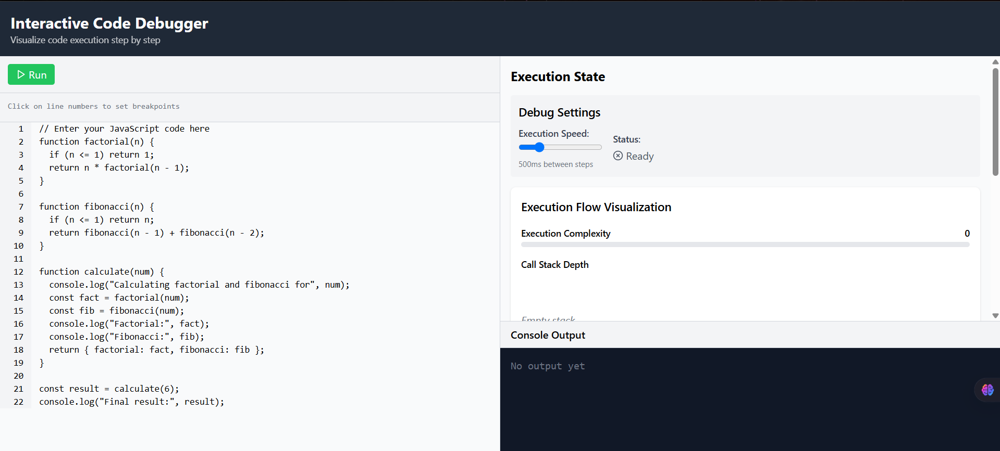

# BreakPointX: Interactive Code Debugger

<p align="center">
  
</p>

<p align="center">
  A powerful visual debugging tool that helps developers understand code execution step by step.
</p>

<p align="center">
  <a href="#features">Features</a> •
  <a href="#demo">Demo</a> •
  <a href="#installation">Installation</a> •
  <a href="#usage">Usage</a> •
  <a href="#how-it-works">How It Works</a> •
  <a href="#roadmap">Roadmap</a> •
  <a href="#contributing">Contributing</a> •
  <a href="#license">License</a>
</p>

---

## Features

BreakPointX transforms the debugging experience by providing a rich, interactive visualization of code execution:

- **Step-by-Step Execution**: Navigate through code line by line with full control
- **Real-Time Variable Tracking**: Watch how variable values change during execution
- **Call Stack Visualization**: See function calls and execution context in real time
- **Breakpoint Support**: Set breakpoints with a simple click on line numbers
- **Execution Flow Graph**: Visual representation of code paths and function calls
- **Performance Metrics**: Track complexity, stack depth, and execution patterns
- **Console Output Integration**: See logs as they would appear during execution
- **Customizable Execution Speed**: Control the pace of code execution

## Demo



## Installation

1. **Clone the repository**
```bash
git clone https://github.com/yourusername/breakpointx.git
cd breakpointx
```

2. **Install dependencies**
```bash
npm install
```

3. **Start the development server**
```bash
npm start
```

This will start both the frontend React application and the backend Node.js server.

## Usage

1. **Enter your JavaScript code** in the editor panel
2. **Set breakpoints** by clicking on the line numbers (optional)
3. **Click Run** to start the execution
4. Use the controls to:
   - **Step**: Move to the next execution step
   - **Continue**: Resume execution after a breakpoint
   - **Reset**: Start over from the beginning
5. **Observe execution** through:
   - The highlighted current line
   - Variable values in the state panel
   - Call stack visualization
   - Console output in real-time

## How It Works

BreakPointX uses a multi-layered architecture to provide a comprehensive debugging experience:

### Frontend (React + Tailwind CSS)
- Interactive code editor with syntax highlighting
- Real-time data visualization using Recharts and custom components
- Responsive UI that adapts to different screen sizes

### Backend (Node.js + Express)
- Code parsing and instrumentation via Abstract Syntax Tree transformation
- Secure code execution in a sandboxed environment
- WebSocket communication for real-time updates

### Execution Engine
1. Code is parsed into an Abstract Syntax Tree
2. Instrumentation points are added to track execution state
3. Modified code runs in a secure VM
4. Execution data is streamed to the frontend in real time

## Technical Architecture

```
┌────────────────┐     ┌────────────────┐     ┌────────────────┐
│                │     │                │     │                │
│  Code Editor   │────▶│  Parser/AST    │────▶│   Execution    │
│                │     │                │     │   Environment  │
└────────────────┘     └────────────────┘     └────────────────┘
                                                      │
┌────────────────┐     ┌────────────────┐     ┌──────▼─────────┐
│                │     │                │     │                │
│  Visualization │◀────│  State Tracker │◀────│  Instrumented  │
│                │     │                │     │  Code Runner   │
└────────────────┘     └────────────────┘     └────────────────┘
```

## Roadmap

- [ ] Support for multiple programming languages (Python, Java, Ruby)
- [ ] Collaborative debugging sessions
- [ ] AI-powered error detection and suggestions
- [ ] Memory usage visualization
- [ ] Custom visualization plugins
- [ ] Code performance optimization suggestions
- [ ] Mobile-friendly interface
- [ ] Integration with popular code editors

## Contributing

Contributions are welcome! Please feel free to submit a Pull Request.

1. Fork the project
2. Create your feature branch (`git checkout -b feature/amazing-feature`)
3. Commit your changes (`git commit -m 'Add some amazing feature'`)
4. Push to the branch (`git push origin feature/amazing-feature`)
5. Open a Pull Request

## License

Distributed under the MIT License. See `LICENSE` for more information.

## Contact

Project Link: [https://github.com/yourusername/breakpointx](https://github.com/yourusername/breakpointx)

---

<p align="center">
  Made with ❤️ by Manish Y M
</p>
